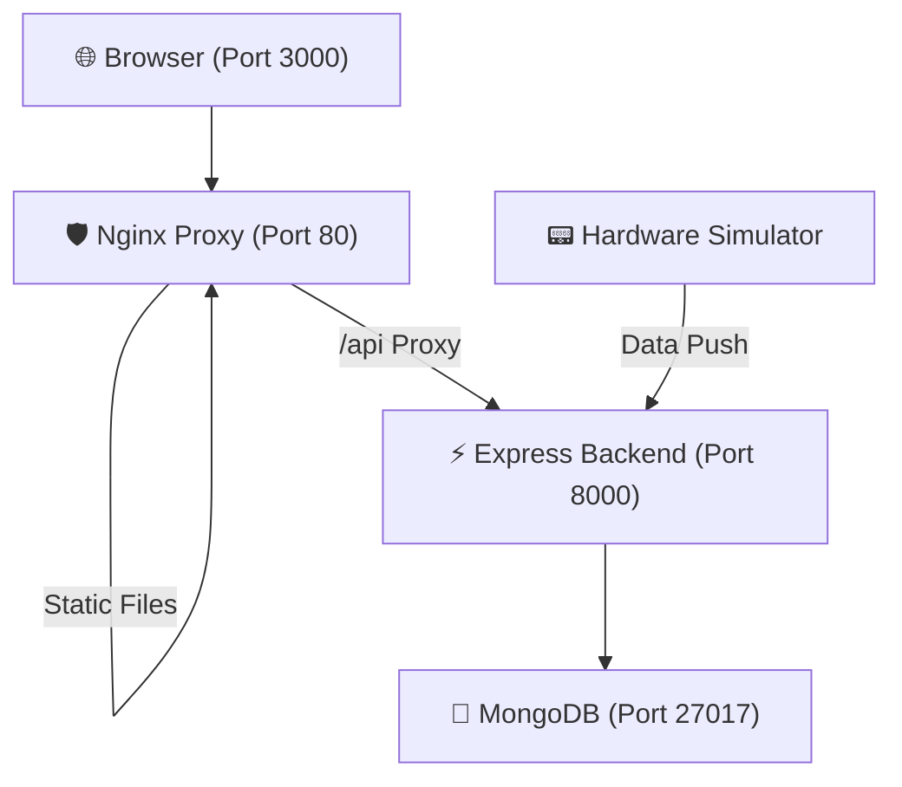

# 🌍 Earthquake Alert System

An advanced, IoT-integrated earthquake detection and notification system. This application monitors real-time seismic activity, provides live visualizations, and sends automated safety alerts to help protect lives and infrastructure.

## 🏗️ System Architecture

The project follows a modern, containerized microservices architecture for high availability and performance:

- **Frontend**: A React-based dashboard served via **Nginx**. It includes a reverse proxy to route API calls securely.
- **Backend**: A **Node.js/Express** server that handles real-time data processing and persistence.
- **Database**: **MongoDB** is used for permanent storage of seismic history and contact logs.
- **Hardware Simulator**: A dedicated container that mimics real IoT sensor input (X, Y, Z axes) for testing.



## 🚀 Key Features

- **Live Seismograph**: Real-time vibration monitoring using ApexCharts, polling every 500ms.
- **Automated Email Alerts**: Instant notifications sent via Gmail SMTP when seismic thresholds are exceeded.
- **Responsive Design**: Modern UI optimized for desktop, tablet, and mobile devices.
- **Persistent History**: MongoDB integration ensures seismic data is preserved across system restarts.
- **Safety Resources**: Dedicated section for pre-quake, during-quake, and post-quake safety instructions.

## 🛠️ Quick Start

### Prerequisites
- [Docker](https://www.docker.com/) and [Docker Compose](https://docs.docker.com/compose/) installed on your machine.

### 1. Environment Configuration
Create a `.env` file in the `backend/` directory with the following variables:

```env
EMAIL_USER=your_email@gmail.com
EMAIL_PASS=your_16_digit_app_password
RECEIVER_EMAIL=your_email@gmail.com
MONGODB_URI=mongodb://mongodb:27017/earthquake_db
PORT=8000
```

> [!IMPORTANT]
> To send emails, you must use a **Gmail App Password**. You can generate one in your Google Account Security settings under "2-Step Verification".

### 2. Launching the System
Run the following command in the project root to build and start all services:

```powershell
docker compose up --build
```

Access the dashboard at: **[http://localhost:3000](http://localhost:3000)**

## 🛡️ Safety Measures
The system provides critical guidance for users:
1. **Drop, Cover, and Hold On**: Immediate actions during shaking.
2. **Stay Indoors**: Avoiding hazards from falling debris.
3. **Emergency Preparation**: Checklists for before and after events.

## 🤝 Contact & Support

Designed and Developed by **QuadraCrafters**.

- **Email**: [pragatibasnet123@gmail.com](mailto:pragatibasnet123@gmail.com)
- **LinkedIn**: [Pragati Basnet](https://www.linkedin.com/in/pragati-basnet-573106263/)
- **X (Twitter)**: [@PragatiBasnet29](https://x.com/PragatiBasnet29)

---
*Licensed under the MIT License.*
